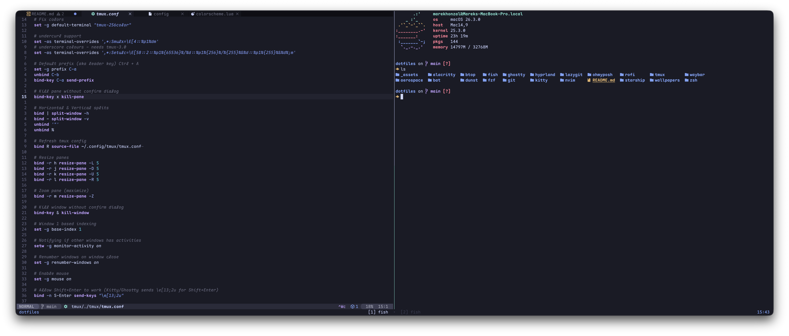

# dotfiles



My personal dotfiles managed with [GNU Stow](https://www.gnu.org/software/stow/).

## Stack

- **Shell:** [Fish](https://fishshell.com/) + [Starship](https://starship.rs/) prompt
- **Terminal:** [Ghostty](https://ghostty.org/)
- **Multiplexer:** [tmux](https://github.com/tmux/tmux)
- **Editor:** [Neovim](https://neovim.io/) (LazyVim)
- **WM:** [AeroSpace](https://github.com/nikitabobko/AeroSpace) (macOS) / [Hyprland](https://hyprland.org/) (Linux)
- **Theme:** [zenbones](https://github.com/zenbones-theme/zenbones.nvim) tokyobones
- **Font:** Maple Mono / JetBrains Mono

## Tools

[bat](https://github.com/sharkdp/bat) ·
[btop](https://github.com/aristocratos/btop) ·
[fzf](https://github.com/junegunn/fzf) ·
[lazygit](https://github.com/jesseduffield/lazygit) ·
[rofi](https://github.com/davatorium/rofi) ·
[dunst](https://github.com/dunst-project/dunst) ·
[waybar](https://github.com/Alexays/Waybar)

## Usage

Clone into your home directory and symlink any config with `stow`:

```sh
cd ~/dotfiles
stow fish ghostty tmux nvim starship  # …or any other package
```
