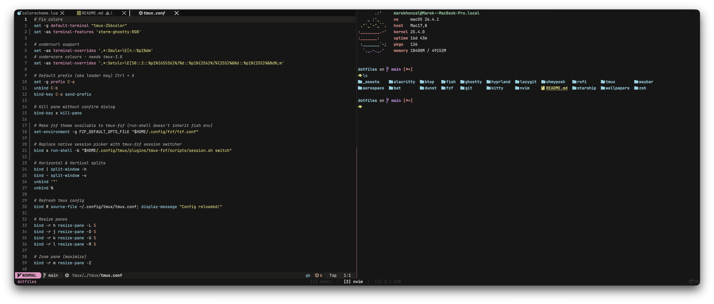

# dotfiles



My personal dotfiles managed with [GNU Stow](https://www.gnu.org/software/stow/).

## Stack

- **Shell:** [Fish](https://fishshell.com/) + [Starship](https://starship.rs/) prompt
- **Terminal:** [Ghostty](https://ghostty.org/)
- **Multiplexer:** [herdr](https://herdr.dev/)
- **Editor:** [Neovim](https://neovim.io/) (LazyVim)
- **WM:** [AeroSpace](https://github.com/nikitabobko/AeroSpace)
- **Theme:** [meowsoot](https://github.com/marekh19/meowsoot.nvim) - my own creation
- **Font:** JetBrains Mono

## Tools

[bat](https://github.com/sharkdp/bat) ·
[fzf](https://github.com/junegunn/fzf) ·
[lazygit](https://github.com/jesseduffield/lazygit) ·
[lazydocker](https://github.com/jesseduffield/lazydocker)

## Usage

Clone into your home directory and symlink any config with `stow`:

```sh
cd ~/dotfiles
stow fish ghostty herdr nvim starship  # …or any other package

# herdr: install the Neovim navigation plugin
herdr plugin install paulbkim-dev/vim-herdr-navigation
```
