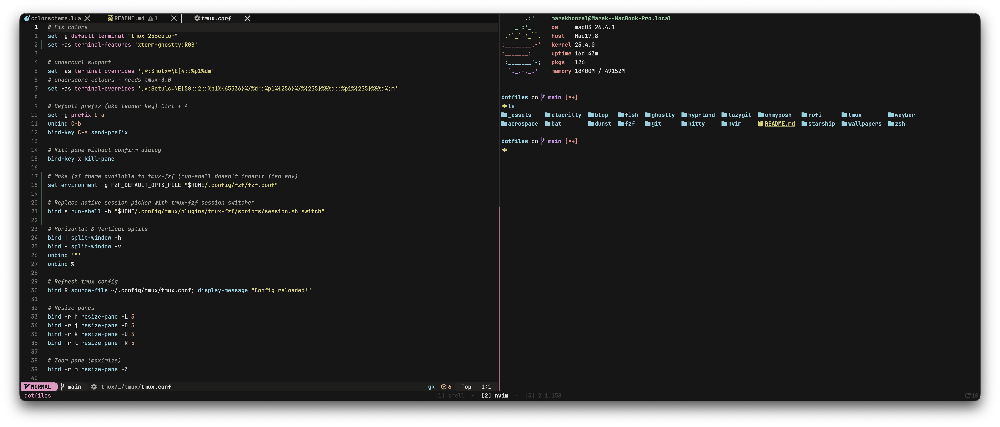

# dotfiles



My personal dotfiles managed with [GNU Stow](https://www.gnu.org/software/stow/).

## Stack

- **Shell:** [Fish](https://fishshell.com/) + [Starship](https://starship.rs/) prompt
- **Terminal:** [Ghostty](https://ghostty.org/)
- **Multiplexer:** [herdr](https://herdr.dev/)
- **Editor:** [Neovim](https://neovim.io/) (LazyVim)
- **WM:** [AeroSpace](https://github.com/nikitabobko/AeroSpace)
- **Theme:** [meowsoot](https://github.com/marekh19/meowsoot.nvim) - my own creation
- **Font:** JetBrains Mono
- **Packages:** [Homebrew](https://brew.sh/) on macOS and Linux

## Tools

[bat](https://github.com/sharkdp/bat) ·
[fzf](https://github.com/junegunn/fzf) ·
[lazygit](https://github.com/jesseduffield/lazygit) ·
[lazydocker](https://github.com/jesseduffield/lazydocker)

## Usage

Install [Homebrew](https://brew.sh/) and clone this repo into your home
directory. Then install the packages and symlink any config with `stow`:

```sh
cd ~/dotfiles
brew bundle install --file=brew/.config/homebrew/Brewfile  # also installs stow
stow bat brew fish fzf ghostty git herdr lazygit nvim starship  # …or any other package

# bat and Delta: compile the bat themes (rerun after adding a .tmTheme)
bat cache --build

# herdr: install the Neovim navigation plugin
herdr plugin install paulbkim-dev/vim-herdr-navigation
```

## Packages

Homebrew installs the packages on both my machines, a MacBook and a Linux
server. `brew/.config/homebrew/Brewfile` lists them:

- Entries at the top install on both systems.
- Entries inside `if OS.mac?` or `if OS.linux?` install only on that system.

`fish/.config/fish/path.fish` sets `HOMEBREW_BUNDLE_FILE` to this file, so
`brew bundle` works from any directory. To add a package, add its line to the
Brewfile and run `brew bundle install`. To remove one, delete its line and run
`brew bundle cleanup`.

| Command | What it does |
|---|---|
| `brew bundle install` | Installs missing packages and upgrades outdated ones. It doesn't upgrade their dependencies; `brew upgrade` does |
| `brew bundle check` | Reports whether the machine matches the Brewfile |
| `brew bundle cleanup` | Lists installed packages the Brewfile doesn't list, then asks before it uninstalls them |

Don't run `brew bundle dump --force`. It overwrites the Brewfile and deletes the
`OS` blocks and comments. To print what is installed, run
`brew bundle dump --file=-`.

To make Homebrew's Fish the login shell, add it to `/etc/shells` first:

```fish
command -s fish | sudo tee -a /etc/shells
chsh -s (command -s fish)
```

### Linux

- **Not from Homebrew:** Docker Engine and cloudflared run as system services
  and come from their vendors' apt repositories. An Ubuntu release upgrade can
  disable these sources by renaming them to `*.disabled` in
  `/etc/apt/sources.list.d/`.
- **Tailscale:** comes from Homebrew, but `tailscaled` needs root. `sudo`
  doesn't find `brew` on its PATH, so use the full path. After
  `brew upgrade tailscale`, run the same command with `restart`:

  ```fish
  sudo --preserve-env=HOME /home/linuxbrew/.linuxbrew/bin/brew services start tailscale
  ```

## Theming

Run `theme <name>` in Fish to switch the color theme of every tool. Run `theme`
alone to print the active theme. Tab completion lists the available Fish
themes. The default theme is `meowsoot`
([meowsoot.nvim](https://github.com/marekh19/meowsoot.nvim)), and this repo
also ships `meowsoot-moon` and `meowsoot-dawn`.

The choice is the Fish universal variable `dotfiles_theme`, so each machine
keeps its own theme. Fish 4.3 or newer is required.

### How it works

The theme name is the file name in each tool's `themes/` folder and the Neovim
colorscheme name. `fish/.config/fish/theme.fish` reads the name and configures
each tool:

| Tool | Theme file | How the tool gets it |
|---|---|---|
| Ghostty | `ghostty/.config/ghostty/themes/<name>` | Generated `~/.config/ghostty/current-theme` |
| Fish | `fish/.config/fish/themes/<name>.theme`, or a built-in Fish theme | `fish_config theme choose <name>` |
| bat | `bat/.config/bat/themes/<name>.tmTheme` | `BAT_THEME` |
| Delta | `git/.config/git/themes/<name>.gitconfig` | Generated `~/.config/git/current-theme.gitconfig` |
| fzf | `fzf/.config/fzf/themes/<name>.conf` | `FZF_DEFAULT_OPTS_FILE` |
| Lazygit | `lazygit/.config/lazygit/themes/<name>.yml` | `LG_CONFIG_FILE` |
| Neovim | Colorscheme `<name>` from an installed plugin | `THEME_NVIM` |

herdr, Starship and Yazi use the terminal colors and need nothing.

The two generated files exist because Ghostty and Git cannot read environment
variables. Git ignores them. A tool without a file for the theme keeps its
default colors. Delta takes its syntax colors from the bat theme of the same
name.

### After switching

- **Fish shells:** open shells switch by themselves.
- **Ghostty:** reload the config with `cmd+shift+,`.
- **Neovim and Lazygit:** restart open instances. Lazygit opened from an old
  Neovim instance keeps the old colors.
- **bat, fzf, Delta:** the next run uses the new theme.

Only interactive Fish shells set the environment variables. An app started
some other way gets default colors, and Neovim falls back to `meowsoot`. After
pulling theme changes, run `exec fish` in open shells to drop old exported
paths.

### Add a theme

Save each tool's theme file under the theme name, for example
`catppuccin-mocha`, then run `theme catppuccin-mocha`. Many themes ship files
for these tools. Adjust them as follows:

- **Fish:** the theme must be in `fish_config theme list`. Fish ships some
  themes, for example `catppuccin-mocha`. Themes with `[light]` and `[dark]`
  sections follow the terminal background.
- **Ghostty:** Ghostty ships many themes under other names, for example
  `Catppuccin Mocha`. Copy the built-in file to `themes/<name>` (on macOS it is
  in `Ghostty.app/Contents/Resources/ghostty/themes/`), or use the theme
  project's file.
- **bat:** bat names a custom theme by its file name. Run `bat cache --build`
  after adding it. bat's built-in themes use other names, for example
  `Catppuccin Mocha`, so save the theme project's `.tmTheme` under the theme
  name instead.
- **Delta:** if the file uses a feature section such as
  `[delta "catppuccin-mocha"]`, add `[delta]` with
  `features = catppuccin-mocha` at the end of the file.
- **fzf:** keep only the `--color` lines. Some themes ship shell scripts.
- **Lazygit:** the file needs a top-level `gui:` key. For Catppuccin, use the
  files in `themes-mergable/`. Your `config.yml` loads after the theme and
  overrides it.
- **Neovim:** add the plugin to `nvim/.config/nvim/lua/plugins/colorscheme.lua`.
  Use a variant name such as `catppuccin-mocha`. Neovim ships its own
  `catppuccin` colorscheme, so the bare name may load the wrong one.

Snacks' automatic Lazygit configuration is disabled so `lg` and `<leader>gg`
use these themes. This also disables Snacks' editor setup; Lazygit uses Fish's
`EDITOR=nvim`.

The wallpapers in `wallpapers/` are colorized for Meowsoot.

### Refresh the Meowsoot files

Run `just extras` in a local meowsoot.nvim checkout, then copy each variant
(`meowsoot`, `meowsoot-moon`, `meowsoot-dawn`) into the matching `themes/`
folder:

| Extra | Destination |
|---|---|
| `ghostty/<name>` | `ghostty/.config/ghostty/themes/` |
| `fish/<name>.theme` | `fish/.config/fish/themes/` |
| `bat/<name>.tmTheme` | `bat/.config/bat/themes/` |
| `delta/<name>.gitconfig` | `git/.config/git/themes/` |
| `fzf/<name>.conf` | `fzf/.config/fzf/themes/` (remove the `--multi` line) |
| `lazygit/<name>.yml` | `lazygit/.config/lazygit/themes/` |

### Stow conflicts

`stow git` cannot link `~/.config/git/` when it already exists as a real
directory with other files. Move or `--adopt` those files first, then run
`stow git` again.
